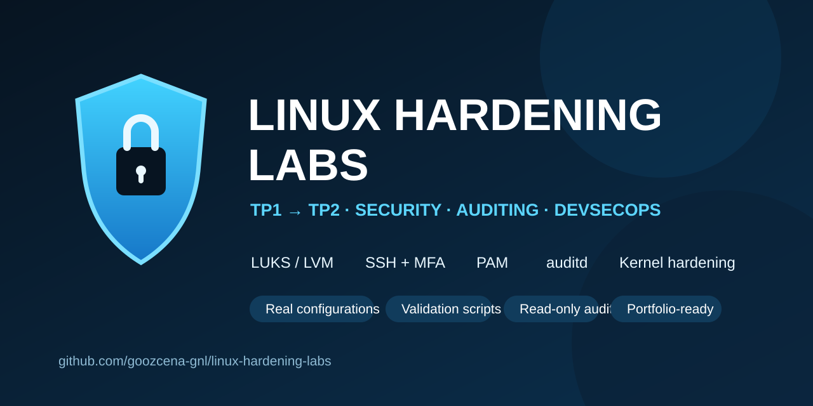

# Linux Hardening Labs

[](https://github.com/goozcena-gnl/linux-hardening-labs/actions/workflows/ci.yml)
[](LICENSE)
[](labs)
[](docs/security-model.md)
[](https://github.com/goozcena-gnl/linux-hardening-labs/releases/latest)

Hands-on Arch Linux hardening labs (TP1 → TP2) covering encrypted storage, secure access, PAM, SSH + MFA, auditd, kernel hardening, permission monitoring and evidence-driven validation.



The project starts with a hardened installation, encrypted application storage and protected administrative access (**TP1**), then extends the same VM with kernel hardening, stronger PAM policy, auditd, SSH key + OTP authentication, restrictive defaults and permission-change tracking (**TP2**).

> This is a learning and portfolio project. It does **not** claim ANSSI, CIS or any other formal compliance certification.

## Start with the 2-minute review

For the fastest technical overview, open the **[Quick Review](docs/quick-review.md)**.

It covers the architecture, SSH/MFA, encrypted storage, kernel lock, auditd, reboot validation and demonstrated skills in seven compact sections.

For the deeper engineering narrative, continue with the **[Linux Hardening Case Study](docs/case-study.md)**.

## Lab progression


| Domain | TP1 | TP2 |
| --- | --- | --- |
| Partitioning and mount hardening | Implemented and reboot-tested | Reused; /boot hardened read-only |
| LUKS2 + LVM /data | Implemented | Persistence revalidated |
| USB/key-file recovery path | Implemented | Revalidated after reboot |
| SSH | TOTP + PAM, root/rescue denied | Public key required, then OTP |
| sudo | Separate localadm/rescue policy | localadm moved to OTP-specific PAM |
| PAM password policy | Baseline | pwquality + faillock + pam_time |
| Kernel/sysctl | Not a TP1 objective | 45 runtime keys checked; module lock separated |
| auditd | Not a TP1 objective | Service + EXECVE/service events verified |
| umask | Baseline permissions | Default 0077 |
| Permission-change tracking | Not a TP1 objective | auditd + monitor service |
| Read-only audit collection | External TP1 audit workflow | Versioned TP2 collector |

## What is actually demonstrated

### TP1

- UEFI Arch Linux installation on a 16 GiB system disk.
- Dedicated mount points with hardened mount options.
- Locked root password and separate `localadm` / `rescue` accounts.
- Dedicated sudo logging.
- SSH restrictions and TOTP authentication.
- LUKS2 → LVM → ext4 storage stack mounted at `/data`.
- A separate `LABEL=KEY` device containing the LUKS key file.
- Automatic startup when the key device is present.
- A recovery script when the key device is absent at boot.
- GRUB configuration protection and authenticated editing.

### TP2

- auditd active with persistent EXECVE rules for interactive users.
- Kernel/sysctl hardening checks and irreversible runtime module loading lock.
- Password quality policy with root enforcement.
- Account lockout after repeated failures.
- Time-based authentication restriction.
- SSH public-key authentication followed by OTP.
- SSH-attempt logging through `pam_exec`.
- OTP-based sudo PAM service for `localadm`.
- Default umask `0077`.
- `/boot` mounted read-only with root-only visibility.
- auditd tracking of `umask` and `chmod` family syscalls.
- Read-only evidence collection with secret filtering.

## Known limitations

The documentation deliberately preserves negative findings instead of turning them into “passes”:

- TP2 evidence did **not** demonstrate auditd `USER_LOGIN` / `USER_LOGOUT` events.
- The configured `pam_time` rule was documented, but an out-of-window rejection was not demonstrated in the final evidence.
- OTP-based sudo was demonstrated for `localadm`; `rescue` retained the standard PAM path.
- The kernel check is point-in-time: no continuous scheduler for `check-kernel-hardening.sh` was demonstrated.
- The separate ANSSI kernel-reference PDF is not redistributed here; the repository therefore does not claim independent completeness against that document.

See [validation.md](docs/validation.md) for the evidence model and limitations.

## Repository layout

```text
.
├── docs/                  # Human-readable engineering documentation
│   ├── tp1/
│   └── tp2/
├── labs/
│   ├── tp1/               # TP1 scripts and sanitized configuration examples
│   └── tp2/               # TP2 scripts, audit rules and service definitions
├── audit/                 # How evidence archives are produced and handled
└── .github/               # CI and dependency updates
```

Raw course PDFs, intermediate Word documents, MFA secrets, LUKS key material and full audit archives are intentionally not stored in this repository.

## Start here

- **[2-minute Quick Review](docs/quick-review.md)**
- **[Portfolio case study](docs/case-study.md)**
- [Architecture](docs/architecture.md)
- [Methodology](docs/methodology.md)
- [TP1 implementation](docs/tp1/implementation.md)
- [TP2 implementation](docs/tp2/implementation.md)
- [Validation and known gaps](docs/validation.md)
- [Evidence gallery](docs/evidence.md)
- [Security model](docs/security-model.md)
- [Lessons learned](docs/lessons-learned.md)
- [References](docs/references.md)
- [Source inventory and publication scope](docs/source-inventory.md)
- [GitHub repository metadata](docs/github-repository-metadata.md)
- [v1.0.0 release notes](docs/releases/v1.0.0.md)

## Safety

Several files describe authentication, boot and storage controls. Do not apply them blindly to a production host. Keep a recovery path, validate syntax before reload, and test reboot/degraded-mode behavior in a disposable environment first.

## License

Code and original documentation in this repository are released under the MIT License. Third-party course material and external reference documents are **not** covered by that license and are not redistributed.
