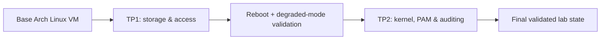

# Linux Hardening Labs

[](https://github.com/goozcena-gnl/linux-hardening-labs/actions/workflows/ci.yml)
[](LICENSE)
[](labs)
[](docs/security-model.md)
[](https://github.com/goozcena-gnl/linux-hardening-labs/releases/latest)

Hands-on Arch Linux hardening labs (**TP1 → TP2**) covering encrypted storage, SSH + MFA, PAM, auditd, kernel hardening and evidence-driven validation.

> **Start here:** [2-minute Quick Review](docs/quick-review.md) · [Portfolio Case Study](docs/case-study.md)

This is a learning and portfolio project. It does **not** claim ANSSI, CIS or any other formal compliance certification.


## At a glance

The same Arch Linux VM is hardened progressively rather than rebuilt between stages:



| Domain | TP1 | TP2 |
| --- | --- | --- |
| Storage | LUKS2 + LVM + ext4 `/data` | Persistence revalidated after reboot |
| Recovery | `LABEL=KEY` + explicit recovery script | Recovery path retained |
| SSH | PAM + TOTP, root/rescue denied | Public key + OTP |
| PAM / sudo | Baseline admin policy | pwquality, faillock, pam_time, sudo OTP |
| Kernel | Baseline system | Targeted sysctl validation + module lock |
| Auditing | Sudo log | auditd EXECVE + permission events |
| Permissions | Hardened mounts | umask `0077` + read-only `/boot` |

## Key technical artifacts

These files carry most of the technical signal:

- [`get_data.sh`](labs/tp1/scripts/get_data.sh) — recover the encrypted DATA stack when the KEY device returns.
- [`collect_tp2_audit.sh`](labs/tp2/scripts/collect_tp2_audit.sh) — read-only evidence collection with secret filtering and SHA-256 manifesting.
- [`kernel-modules-lock.service`](labs/tp2/configs/kernel-modules-lock.service) — apply the irreversible module-loading lock after required modules load.
- [auditd execution rules](labs/tp2/configs/50-user-exec.rules) and [permission rules](labs/tp2/configs/60-user-perms.rules).
- [authentication excerpts](labs/tp2/configs/authentication-examples.md) — SSH, PAM, pwquality, faillock and sudo OTP.

## Evidence before claims

The project separates:

1. **requirement** — expected behavior;
2. **persistent configuration** — what should survive reboot;
3. **runtime state** — what is actually active;
4. **functional evidence** — whether the behavior is demonstrated.

That includes negative tests such as denied root SSH, denied SSH without a public key, denied writes to `/boot`, and rejected module loading after `kernel.modules_disabled=1`.

See the [Evidence Gallery](docs/evidence.md) and [Validation / known gaps](docs/validation.md).

Known gaps are kept visible rather than promoted to successful controls. In particular, auditd login/logout events and an out-of-window `pam_time` denial were not demonstrated, and the repository makes no independent ANSSI compliance claim.

## Repository layout

```text
.
├── docs/                  # Architecture, case study, evidence and validation
├── labs/
│   ├── tp1/               # Recovery script and sanitized TP1 config notes
│   └── tp2/               # Audit collector, audit rules, systemd and auth examples
├── audit/                 # Audit-handling documentation
└── .github/               # CI and Dependabot
```

Raw course PDFs, intermediate Word documents, MFA secrets, LUKS key material and raw audit archives are intentionally excluded.

## Review paths

### Recruiter / 2 minutes

- [Quick Review](docs/quick-review.md)

### Hiring manager / 5 minutes

- [Portfolio Case Study](docs/case-study.md)
- [Evidence Gallery](docs/evidence.md)
- [Validation and known gaps](docs/validation.md)

### Technical reviewer

- [Architecture](docs/architecture.md)
- [Methodology](docs/methodology.md)
- [TP1 implementation](docs/tp1/implementation.md)
- [TP2 implementation](docs/tp2/implementation.md)
- [Security model](docs/security-model.md)
- [Lessons learned](docs/lessons-learned.md)
- [Source inventory and publication scope](docs/source-inventory.md)
- [References](docs/references.md)

## Safety

Several files describe authentication, boot and storage controls. Do not apply them blindly to a production host. Keep a recovery path, validate syntax before reload, and test reboot/degraded-mode behavior in a disposable environment first.

## License

Code and original documentation in this repository are released under the MIT License. Third-party course material and external reference documents are **not** covered by that license and are not redistributed.
