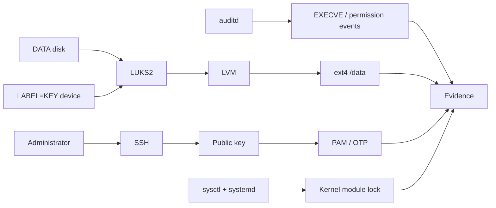

# Portfolio case study

## Linux hardening from installation to verified runtime state

This case study condenses the TP1 and TP2 work into a recruiter-friendly engineering narrative.

**Scope:** Arch Linux · Bash · LUKS2 · LVM · OpenSSH · PAM · MFA · auditd · sysctl · systemd

**Goal:** harden a Linux VM while keeping administrative recovery, encrypted storage and post-reboot operability demonstrably intact.

> The project is evidence-driven. It distinguishes what was requested, what was configured, what was active at runtime and what was functionally demonstrated.

## 60-second overview

The work starts with a fresh Arch Linux VM and progressively adds security controls in two stages.

### TP1 — establish a hardened base

- split the system into dedicated filesystems with restrictive mount options;
- lock direct root password use and separate normal administration from recovery;
- harden SSH and require TOTP-based authentication;
- build an encrypted `/data` stack with LUKS2 and LVM;
- use a separate `LABEL=KEY` device for key-file based unlock;
- preserve degraded boot when the key device is missing;
- provide an explicit recovery script;
- protect GRUB editing.

### TP2 — extend and verify the control plane

- add auditd execution tracking;
- harden kernel/sysctl runtime values;
- prevent hot-loading additional kernel modules after boot;
- strengthen PAM password quality and lockout behavior;
- evolve SSH to public key + OTP;
- require OTP for the main sudo administrator path;
- enforce restrictive default permissions;
- mount `/boot` read-only;
- track permission changes;
- revalidate the encrypted storage stack after reboot.

## Architecture



The design deliberately keeps availability and recovery in scope. Missing KEY media must not prevent the operating system from booting, and security changes must survive reboot without breaking the encrypted storage chain.

## Security evolution

| Area | TP1 | TP2 |
| --- | --- | --- |
| Storage | LUKS2 + LVM + ext4 | Persistence revalidated after reboot |
| SSH | PAM + TOTP | Public key + OTP |
| Privilege | Separate sudo policies | OTP-specific sudo PAM for `localadm` |
| Kernel | Baseline system | Targeted sysctl hardening + module lock |
| Auditing | Sudo log | auditd EXECVE + permission-change events |
| Permissions | Hardened mounts | umask `0077` + read-only `/boot` |
| Recovery | KEY-aware `get_data.sh` | Revalidated with final hardening active |

## Engineering decisions that mattered

### 1. Availability was preserved during storage hardening

The encrypted DATA volume uses `nofail` semantics so the machine can still boot when the KEY device is absent.

The recovery path is explicit rather than implicit: `get_data.sh` waits for `LABEL=KEY`, opens LUKS, activates LVM and mounts `/data`.


### 2. Authentication was hardened incrementally

TP1 validates TOTP-based SSH while denying root and rescue remote access.

TP2 removes password authentication from the SSH path and requires:

```text
public key -> PAM keyboard-interactive -> OTP
```

This reduces reliance on password-only remote authentication while keeping PAM policy visible and testable.


### 3. Kernel module locking was ordered after required module loading

`kernel.modules_disabled=1` is irreversible until reboot. Applying it too early risks breaking storage or other boot dependencies.

A dedicated systemd unit therefore applies the lock after `systemd-modules-load.service`.

The functional negative test is a rejected `modprobe dummy`.


### 4. Audit evidence was treated separately from configuration

A rule existing on disk is not considered enough.

The lab checks both loaded audit rules and actual events, including a demonstrated `/usr/bin/date` EXECVE record with `auid=1000`.


### 5. Reboot was part of the security test

The final validation checks that hardening remains compatible with the TP1 storage design after reboot:

- `data_crypt` remains active;
- `vg_data/lv_data` remains available;
- `/data` remains mounted;
- the kernel module lock remains enabled;
- the validated services remain active;
- no failed systemd unit was reported in the documented test.


## Validation philosophy

Each important control is evaluated through four layers:

1. **Requirement** — what behavior is expected?
2. **Persistent configuration** — what should survive reboot?
3. **Runtime state** — what is active now?
4. **Functional evidence** — does the expected behavior actually occur?

Negative tests are used where they add value, for example:

- SSH root denied;
- SSH rescue denied;
- SSH without a public key denied in TP2;
- wrong GRUB authentication denied;
- writes to `/boot` denied;
- `modprobe` denied after kernel module locking.

This approach avoids treating a configuration file as proof by itself.

## What the project does not hide

The repository keeps incomplete evidence visible rather than turning it into a PASS.

Known limitations include:

- auditd login/logout event types were not demonstrated;
- the `pam_time` rule was configured, but an out-of-window denial was not demonstrated;
- sudo OTP was demonstrated for `localadm`, not generalized to `rescue`;
- kernel comparison was point-in-time rather than continuous monitoring;
- no independent ANSSI compliance claim is made.

That distinction is intentional: **credible evidence is more useful than a perfect-looking scorecard**.

## Skills demonstrated

| Domain | Demonstrated through |
| --- | --- |
| Linux administration | Arch installation, mounts, users, permissions, systemd |
| Linux security | SSH, PAM, sudo, GRUB, kernel hardening |
| Storage security | LUKS2, LVM, key-file handling, degraded boot |
| Bash | Recovery and audit scripts |
| Authentication | Public keys, TOTP, faillock, pwquality |
| Auditing | auditd rules, EXECVE tracking, permission events |
| Validation | Runtime checks, negative tests, reboot tests |
| DevSecOps | Secret-aware publication, CI, Gitleaks, documentation |
| GitHub | PR workflow, Actions, Dependabot, releases, branch protection |

## Repository paths worth reviewing

- [Evidence gallery](evidence.md)
- [Architecture](architecture.md)
- [Methodology](methodology.md)
- [TP1 implementation](tp1/implementation.md)
- [TP2 implementation](tp2/implementation.md)
- [Validation and known gaps](validation.md)
- [TP2 read-only audit collector](../labs/tp2/scripts/collect_tp2_audit.sh)
- [TP1 encrypted storage recovery script](../labs/tp1/scripts/get_data.sh)

## Takeaway

The main outcome is not a list of Linux hardening settings.

It is a repeatable security-engineering workflow:

```text
design -> configure -> inspect effective state -> test failure paths
       -> reboot -> revalidate -> collect evidence -> document limitations
```

That workflow is transferable to DevOps, SRE, platform engineering and DevSecOps environments where secure configuration must remain operable and verifiable.
