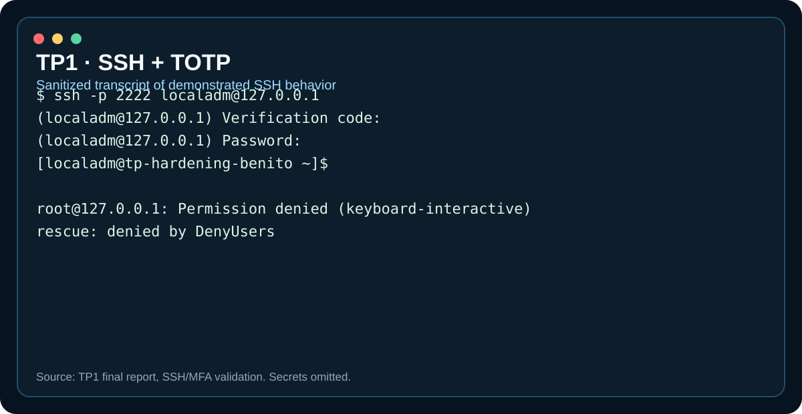
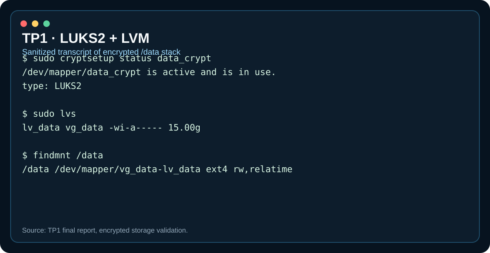
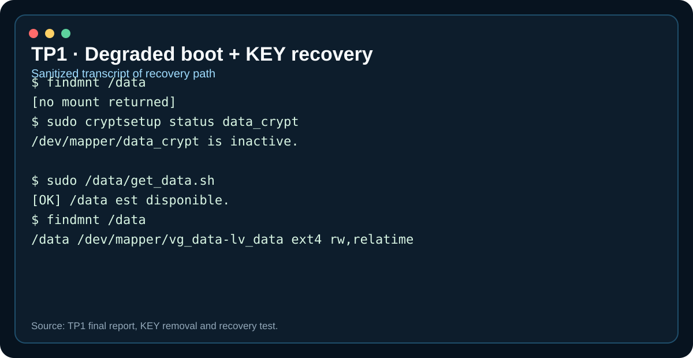

# Evidence gallery

This gallery presents **sanitized visual transcripts** derived from the final TP1 and TP2 reports.

They are intentionally **not presented as raw screenshots**. Host-specific details, secret-bearing material and unnecessary noise were removed so the repository remains safe and readable.

The underlying claims remain tied to the documented tests in the final reports and to the repository validation notes.

## TP1

### SSH with TOTP

Demonstrates a successful `localadm` SSH authentication flow using TOTP followed by the Unix password, plus negative tests for restricted accounts.

### LUKS2 + LVM storage

Demonstrates the active LUKS2 mapping, the `vg_data/lv_data` logical volume and the ext4 filesystem mounted on `/data`.

### KEY removal and recovery

Demonstrates degraded boot behavior with `/data` unavailable, followed by recovery through `get_data.sh` when the KEY device returns.

## TP2

### auditd

Shows the demonstrated `enabled 1`, `lost 0` state and an actual `/usr/bin/date` EXECVE event. Login/logout audit event types were not demonstrated and remain documented as a gap.

### Kernel hardening and module lock

Shows the final targeted sysctl check, `kernel.modules_disabled=1`, and the negative `modprobe dummy` test.

### Persistence after reboot

Shows that the encrypted storage chain remains usable after reboot and that the documented systemd validation reported no failed units.

## Why sanitized transcripts instead of raw screenshots?

Raw terminal screenshots are useful during assessment, but poor long-term repository artifacts when they:

- expose unnecessary IP addresses, hostnames or local paths;
- contain large amounts of unrelated terminal output;
- are difficult to read on mobile;
- mix secrets or sensitive state with harmless evidence;
- become hard to diff and maintain.

The SVG transcripts keep the important result visible while the Markdown documentation explains the context and limitations.
