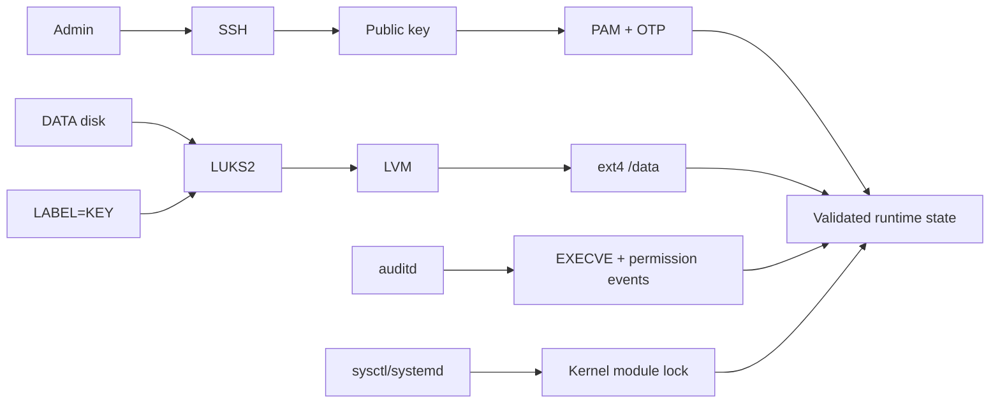

# Quick Review — Linux Hardening Labs

> **2-minute technical walkthrough** for recruiters, DevOps/SRE engineers and security reviewers.

This page shows the project's most important controls and evidence without requiring a full read of the TP documentation.

**Stack:** Arch Linux · Bash · LUKS2 · LVM · OpenSSH · PAM · MFA · auditd · sysctl · systemd

## 1. Architecture at a glance



The lab hardens access, storage and runtime behavior while preserving a tested recovery path and post-reboot operability.

## 2. Remote access: SSH + MFA

TP1 validates TOTP-based SSH and denies direct root/rescue access. TP2 evolves this to:

```text
public key -> PAM keyboard-interactive -> OTP
```


**Why it matters:** the remote path no longer relies on password-only authentication, and negative access tests are part of validation.

## 3. Encrypted storage: LUKS2 + LVM

The DATA path is:

```text
DATA disk -> LUKS2 -> LVM -> ext4 -> /data
```


A separate `LABEL=KEY` device provides key-file based unlock. If it is missing, the OS still boots and `get_data.sh` provides an explicit recovery path.

[Review the recovery script](../labs/tp1/scripts/get_data.sh)

## 4. Kernel hardening and irreversible module lock

TP2 validates a targeted runtime sysctl set and applies:

```text
kernel.modules_disabled = 1
```

only after required modules have loaded.


**Negative test:** `modprobe dummy` is rejected after the lock is active.

This ordering matters because the module-loading lock cannot be reversed before reboot.

## 5. Runtime auditing with auditd

auditd tracks command execution for interactive users and selected permission changes.


The demonstrated state includes:

- `enabled 1`;
- `lost 0`;
- a real `/usr/bin/date` EXECVE event;
- persistent EXECVE rules for 32-bit and 64-bit syscall ABIs.

[Review the audit rules](../labs/tp2/configs/50-user-exec.rules) · [Review the permission rules](../labs/tp2/configs/60-user-perms.rules)

## 6. Reboot and persistence validation

Hardening is not considered complete until the machine survives reboot with required functionality intact.


The documented final check confirms:

- LUKS2 mapping active;
- LVM logical volume available;
- `/data` mounted;
- module-loading lock still active;
- validated services active;
- no failed systemd unit in the documented test.

## 7. What this project demonstrates

| Area | Evidence |
| --- | --- |
| Linux administration | Arch installation, mounts, systemd, users, permissions |
| Storage security | LUKS2, LVM, key-file handling, recovery path |
| Authentication | SSH, public keys, PAM, TOTP, faillock, pwquality |
| Kernel security | sysctl validation, delayed module lock |
| Auditing | auditd rules, EXECVE events, permission tracking |
| Bash | recovery and read-only audit tooling |
| Validation | effective-state checks, negative tests, reboot testing |
| DevSecOps | CI, ShellCheck, Gitleaks, Dependabot, secret-aware publishing |

## Review path

For a deeper review:

1. [Portfolio case study](case-study.md) — engineering narrative and decisions.
2. [Evidence gallery](evidence.md) — all curated visual evidence.
3. [TP1 implementation](tp1/implementation.md) — storage and access baseline.
4. [TP2 implementation](tp2/implementation.md) — kernel, PAM and auditing.
5. [Validation and known gaps](validation.md) — what was and was not demonstrated.
6. [Read-only TP2 audit collector](../labs/tp2/scripts/collect_tp2_audit.sh) — evidence collection code.

## Important limitations

The repository deliberately keeps incomplete evidence visible:

- auditd login/logout event types were not demonstrated;
- no out-of-window `pam_time` denial was demonstrated;
- sudo OTP was demonstrated for `localadm`, not generalized to `rescue`;
- kernel comparison is point-in-time, not continuous monitoring;
- no independent ANSSI compliance claim is made.

**The portfolio goal is verifiable engineering, not a perfect-looking compliance score.**
