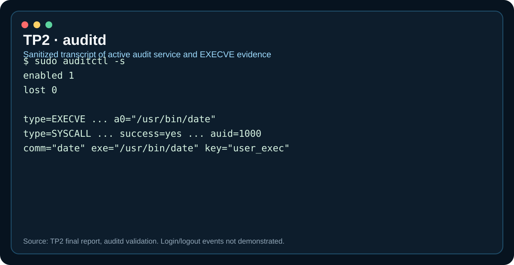
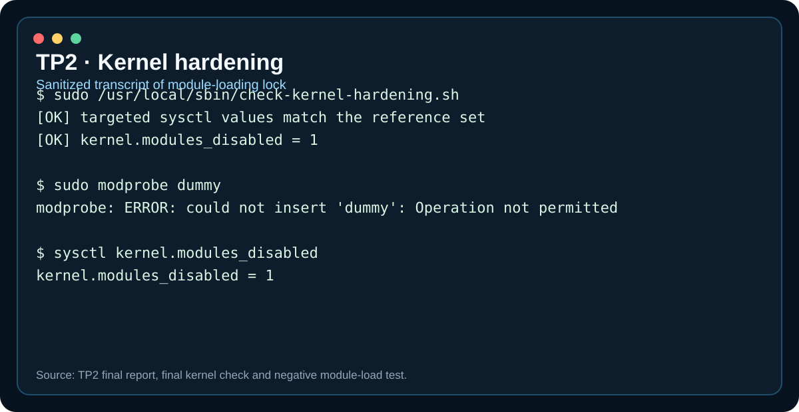
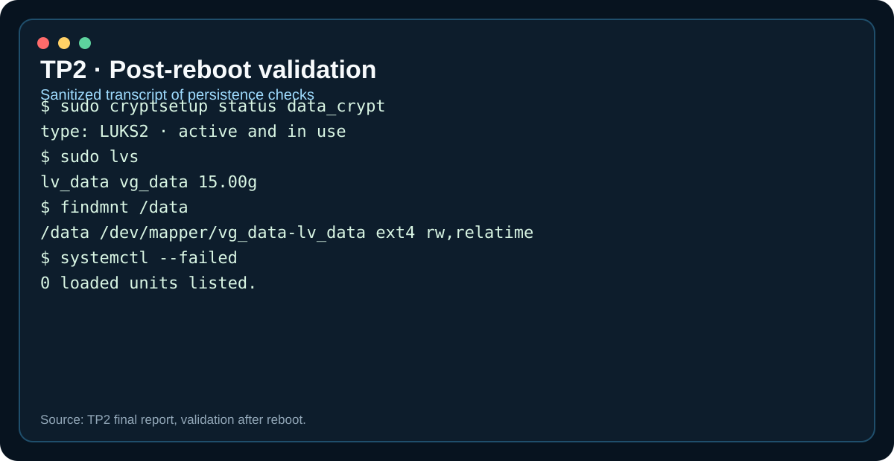

# TP2 implementation

## 1. auditd

auditd was enabled and the final test showed `enabled 1` and `lost 0`.

Persistent rules tracked `execve` in 64-bit and 32-bit syscall ABIs for sessions with `auid >= 1000` and a defined audit ID.

An actual `/usr/bin/date` execution and service start/stop events were found with `ausearch`.

The evidence did **not** contain `USER_LOGIN` / `USER_LOGOUT` events, so that requirement remains not demonstrated.

## 2. Kernel hardening

The lab stored persistent sysctl settings in `/etc/sysctl.d/99-anssi-hardening.conf` and checked a 45-key runtime set.

`kernel.modules_disabled=1` was intentionally excluded from the normal early sysctl load. A dedicated systemd service sets it after `systemd-modules-load.service`.

This matters because the value is one-way until reboot.

A manual validation script compared effective values with the reference configuration and logged differences to `/var/log/kernel_modif.log`.

The final report documented detected test deviations for:

- `net.ipv4.conf.all.log_martians`;
- `kernel.dmesg_restrict`;
- `kernel.modules_disabled`.

No continuous scheduler for this check was demonstrated.

## 3. Password policy

The documented `pwquality.conf` values were:

```ini
minlen = 16
minclass = 4
dcredit = -2
ucredit = -2
lcredit = -2
ocredit = -2
maxrepeat = 2
maxsequence = 1
gecoscheck = 1
usercheck = 1
enforce_for_root
```

`pam_pwquality` preceded `pam_unix` with `use_authtok`.

## 4. Account lockout and time restriction

faillock:

```ini
deny = 3
fail_interval = 900
unlock_time = 900
```

The lab demonstrated the three-failure lockout.

The time rule was:

```text
login|sshd;*;!root;Al0800-2000
```

An in-window login was demonstrated; an out-of-window denial was not.

## 5. SSH public key + OTP

Effective SSH intent:

```text
UsePAM yes
PermitRootLogin no
PubkeyAuthentication yes
PasswordAuthentication no
KbdInteractiveAuthentication yes
AuthorizedKeysFile .ssh/authorized_keys
DenyUsers rescue
AuthenticationMethods publickey,keyboard-interactive:pam
```

The SSH PAM authentication phase used Google Authenticator without `pam_unix`. The result is:

```text
public key -> PAM keyboard-interactive -> OTP
```

A successful key + OTP session and a no-key denial were demonstrated.

## 6. SSH attempt logging

`pam_exec` runs `log-ssh-attempt.sh` before the OTP control. It records timestamp, PAM username and remote address.

Important limitation: attempts rejected before PAM are not written to this custom log.

## 7. sudo OTP

For `localadm`, sudo was redirected to a dedicated PAM service:

```text
Defaults:localadm pam_service=sudo-localadm
Defaults:localadm pam_login_service=sudo-localadm
```

The dedicated service uses `pam_google_authenticator` for authentication.

This was demonstrated for `localadm`, not generalized to every sudo-capable account.

## 8. umask and /boot

The default user mask was set to `0077`.

`/boot` was mounted read-only with root-only FAT masks and mode 700. A write test was denied.

## 9. Permission-change tracking

auditd rules track successful `umask`, `chmod`, `fchmod`, `fchmodat` and `fchmodat2` syscalls for interactive users.

`user-perms-monitor.service` continuously consumes events with an ausearch checkpoint and appends them to `/var/log/user_perms.log`.

## 10. Final reboot

After reboot, the lab verified:

- `dm_crypt` / device-mapper crypto support;
- active LUKS2 mapping;
- active `vg_data/lv_data`;
- mounted `/data`;
- `kernel.modules_disabled=1`;
- active sshd, auditd, kernel module lock, permission monitor and cryptsetup unit;
- no failed systemd units in the documented test.

## Visual evidence

Representative, sanitized evidence from the final report is available in the [evidence gallery](../evidence.md#tp2).






